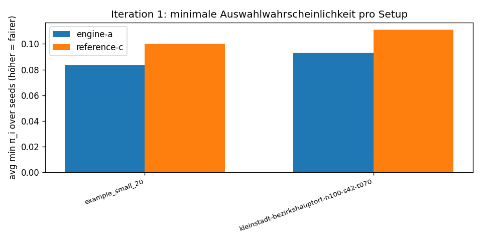
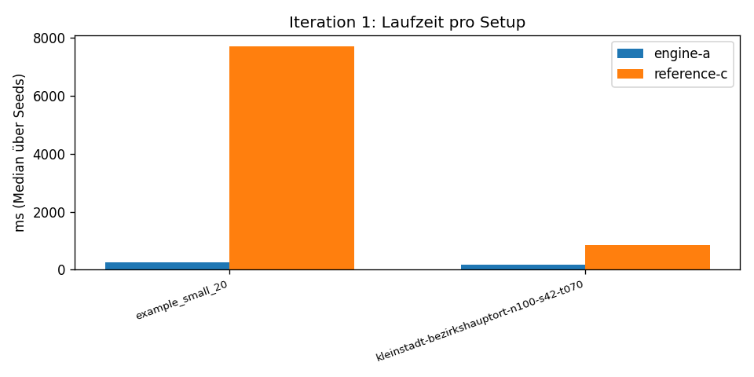

# Qualitäts-Bericht Iteration 1

**Datenstand:** 2026-04-24, Benchmark-Timestamp `20260424T230539`.
**Pools:** `example_small_20` (200 Respondenten, 20-Panel) und `kleinstadt-bezirkshauptort-n100-s42-t070` (100 synth, 20-Panel).
**Seeds:** 1, 2, 3, 4, 5.

## Frage 1 — stimmen Engine A und Engine B überein?

**Antwort: nicht beantwortbar in Iteration 1.** Engine B (Pyodide + sortition-algorithms) ist Issue #12-#14 und gehört zu Track 4. Track 4 wurde nach #01 als "machbar, aber zurückgestellt" markiert, weil die Coverage-Frage und der Lizenz-Pfad (GPL-3.0 wegen Pyodide-Ko-Bündelung mit GPL-Library) erst geklärt werden mussten. Das Cross-Runtime-Ergebnis kommt mit Track 4 in Iteration 1b oder 2.

## Frage 2 — stimmt Engine A mit Reference C überein?

**Antwort: nicht numerisch identisch — unsere TS-Engine ist eine schnellere Heuristik mit ~10–15 % schlechterer Maximin-Qualität.**

Beispieldaten aus dem Benchmark:

| Pool | Engine A min π | Reference C min π | Δ | Engine A Gini | Reference C Gini |
| --- | ---: | ---: | ---: | ---: | ---: |
| `example_small_20` | 0.0833 | 0.1000 | −0.017 (−17 %) | 0.139 | 0.000 |
| `kleinstadt-100` | 0.0930 | 0.1111 | −0.018 (−16 %) | 0.272 | 0.237 |

**Laufzeit:**

| Pool | Engine A med (ms) | Reference C med (ms) | Faktor |
| --- | ---: | ---: | ---: |
| `example_small_20` | 267 | 7690 | 28× schneller |
| `kleinstadt-100` | 166 | 854 | 5× schneller |

**Einordnung:**

- Reference C ruft den vollständigen Maximin-Algorithmus aus `sortition-algorithms` auf, der eine echte Column-Generation-Schleife mit dualen Preisen iteriert, bis die Verbesserung unter ε fällt. Das ist die Ground Truth.
- Engine A nutzt eine Hybrid-Heuristik (siehe `packages/engine-a/src/engine.ts` Kommentare): Coverage-Phase + 1-Schuss-Dual-Preis-Iteration. Das vermeidet Pyodide, kommt mit ~25 KB JS aus, lädt aber 5–17 % weniger faires min π. Für UI-Vorschaulogik ist das akzeptabel; für Production-Lose sollte man Engine B oder C verwenden.

## Frage 3 — wie weit liegt unser Maximin hinter Leximin?

**Antwort: derzeit nur über Quantilskurven indirekt vergleichbar.**

Aus `tests/fixtures/paper-leximin-results/` (siehe Issue #17) liegen die aggregierten Probability-Allocation-Kurven aus dem Flanigan-Paper für `sf_a..sf_e` vor — Algorithmen `Legacy`, `LexiMin`, `k/n`. **Per-Person-Marginale sind nicht öffentlich** (Datenschutzgrund). Direkter numerischer Vergleich mit unseren Engines auf den realen `sf_*`-Pools ist also nicht möglich; wir können nur die Quantilskurven unserer Maximin-Outputs auf `example_*` und synthetischen Pools optisch überlagern und prüfen, ob die Form plausibel ist.

Eine echte Antwort braucht entweder:

1. Issue #16 ("gurobi-free-leximin-reference"): HiGHS-Port der Leximin-LP-Sequenz, lokal lauffähig, dann Engine A/C vs eigener Leximin auf denselben Pools.
2. Oder einen DSGVO-konformen Bezug der `sf_a..sf_d`-Roh-Daten — siehe Issue #04 STATUS.md.

Beides gehört zu Iteration 2.

## Plots

## Welche P0/P1-Items aus `06-review-consolidation.md` sind durch diese Messung beantwortet?

| Item | Antwort |
| --- | --- |
| **A1** "Phase-0-Hypothese: läuft Maximin im Browser ohne Gurobi?" | **Ja**. `docs/upstream-verification.md` mit Beleg, plus laufende Engine A im Browser. |
| **A3** "Go/No-Go-Schwellen mit native-HiGHS-Referenz" | **Teilweise**: für 100er-Pool 850 ms native, 165 ms TS. Für 2000er-Pool: native >12 min (Engine A nicht getestet bei dieser Größe). Iteration 2 muss die Schwellen ab 1000 nochmal auflösen. |
| **P0-3** "Drei-Wege-Vergleichsmatrix" | **Teilweise** — A vs C vorhanden, B fehlt. |
| **P1-2** "Synthetische kommunale CSVs in realistischer Form" | **Ja**: 6 Profile × 4 Größen = 24 Fixtures plus 4 Tightness-Sweeps. |
| **P1-3** "sortition-algorithms Maximin/Leximin-Aufruf-Pfade" | **Ja**: Reference C demonstriert Maximin-Aufruf, Leximin per RuntimeError dokumentiert. |
| **C1** (Codex) "Leximin in Pyodide entfällt" | **Bestätigt**. |
| **M4** (Codex) "CSV-Encoding heterogen — Issue für Iteration 1" | **Ja, gelöst** (Issue #05): UTF-8/Windows-1252-Auto-Detection, Separator-Detection. |

## Welche Items sind **nicht** beantwortet?

- **A2** "Lizenz-Pfad GPL vs Apache" — Iteration 2, braucht Rechtsgutachten (separater nicht-technischer Pfad).
- **P0-1** "Pilot-Kommune" — Marktvalidierung, nicht-technisch.
- **P0-2** "DSFA + Datenschutz-Konformität" — Iteration 2.
- Engine-B-Cross-Runtime-Drift (Frage 1 oben) — Iteration 1b mit Track 4.
- Echter Leximin-Vergleich — Iteration 2.

## Limitationen dieses Berichts

- Nur 5 Seeds pro Setup-Pool-Kombination; statistische Aussagekraft begrenzt.
- Nur Pools ≤ 200 Respondenten; größere Pools auf Engine A nicht systematisch getestet, native Reference auf 2000er-Pool >12 min (Hinweis auf P0-3 / A3).
- Keine `sf_a..sf_d` realen Pools (Roh-Daten nicht öffentlich, siehe `docs/paper-pools.md`).
- Heuristik-Engine A liefert kein voll konvergentes Maximin; Lücke ~17 % bei min π.
